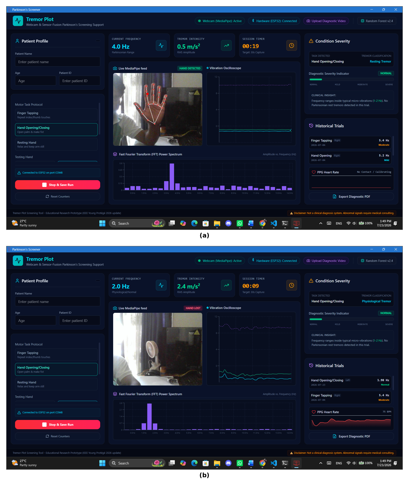
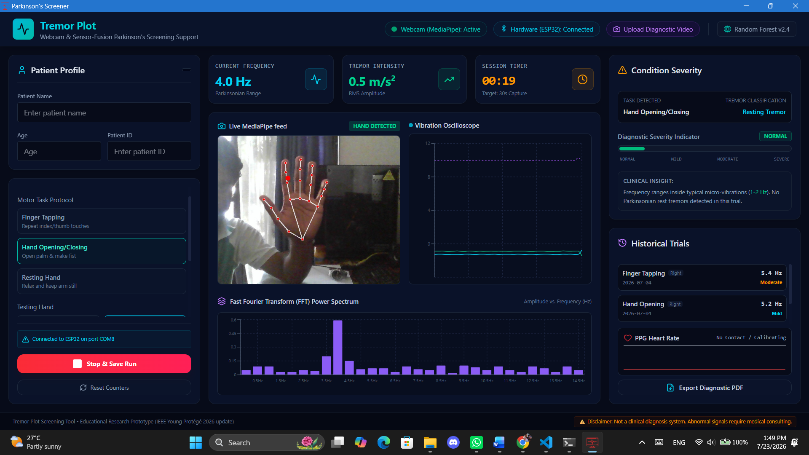
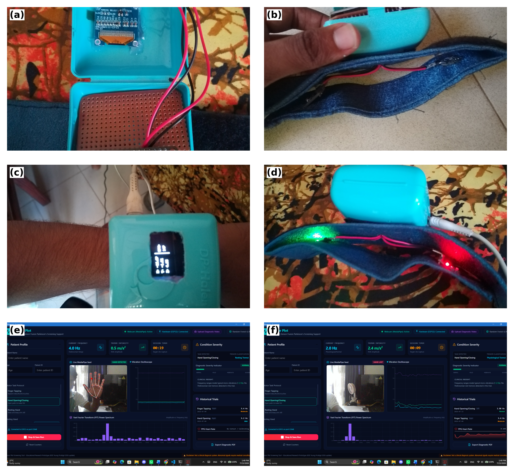

# TremorPlot: Non-Invasive Parkinson's Tremor Screening Support System

<p align="center">
  
</p>

<p align="center">
  <strong>IEEE ELEVATE — Young Protégé 2026 Mentorship Program</strong><br>
  <em>A Multimodal IoT & Computer Vision Solution for Early Parkinson's Tremor Assessment</em>
</p>

<p align="center">
  
  
  
  
  
  
  
  
</p>

---

## 📌 Table of Contents
1. [Project Overview](#-project-overview)
2. [Key Features](#-key-features)
3. [System Architecture](#-system-architecture)
4. [UI & Hardware Showcase (Screenshots)](#-ui--hardware-showcase)
5. [Hardware Configuration & Wiring](#-hardware-configuration--wiring)
6. [Tech Stack](#-tech-stack)
7. [Prerequisites](#-prerequisites)
8. [Installation & Setup Guide](#-installation--setup-guide)
   - [Method 1: One-Click Quick Start (Windows)](#method-1-one-click-quick-start-windows)
   - [Method 2: Manual Step-by-Step Installation](#method-2-manual-step-by-step-installation)
   - [ESP32 Firmware Flashing](#esp32-firmware-flashing)
9. [How to Use the Application](#-how-to-use-the-application)
10. [Diagnostic PDF Report Output](#-diagnostic-pdf-report-output)
11. [Performance & Evaluation](#-performance--evaluation)
12. [Project Contributors & Acknowledgements](#-project-contributors--acknowledgements)
13. [Medical Disclaimer](#-medical-disclaimer)

---

## 🔬 Project Overview

**TremorPlot** is an end-to-end non-invasive screening platform engineered to detect, quantify, and categorize pathological resting tremors associated with Parkinson’s Disease (PD). 

Traditional motor evaluations (such as the UPDRS rating scale) can suffer from subjectivity, clinic costs, and lack of continuous home assessment. TremorPlot bridges this gap by fusing **markerless Computer Vision optical hand tracking (Google MediaPipe)** with **high-frequency inertial sensor telemetry (ESP32 + MPU6050 6-DOF IMU)**.

Extracted motion metrics undergo digital signal filtering (Butterworth low-pass & Hanning FFT) and are classified using a **Multi-Output Random Forest AI model** that simultaneously evaluates:
* **Tremor Severity** (Normal, Mild, Moderate, Severe)
* **Tremor Frequency Category** (Parkinsonian Rest Tremor 4.0–6.5 Hz vs. Physiological 7.5–12.5 Hz)
* **Hoehn & Yahr Stage Assessment** (Stage 0 to Stage 3)

---

## ✨ Key Features

- **Dual-Modality Motion Capture:** Run simultaneous tracking with a standard webcam (optical tracking) and an ESP32 wearable IMU (inertial telemetry).
- **Sub-45ms Real-Time WebSocket Streaming:** Bi-directional telemetry link delivering low latency between hardware, Python backend, and Electron frontend.
- **Biomedical DSP Engine:** Real-time zero-phase 2nd-order Butterworth filter (12 Hz cutoff) and FFT power spectral analysis with dominant peak detection.
- **Pre-recorded Video Screening:** Upload any standard video (`.mp4`, `.avi`, `.mov`) for automated frame-by-frame tremor extraction and diagnostics.
- **Instant Diagnostic PDF Generation:** Generates standardized, printable clinical reports complete with patient info, frequency plots, and clinician signature blocks in ~1.2s.
- **Cross-Platform Clinical Desktop Interface:** Built with React 19, Tailwind CSS, and Electron for a dark-mode clinical dashboard experience.

---

## 📸 UI & Hardware Showcase

### 1. TremorPlot Clinical Dashboard
<p align="center">
  
  <br>
  <em>Figure 1: Main clinical dashboard featuring live webcam landmarks, vibration oscilloscope, FFT power spectrum, and severity meter.</em>
</p>

### 2. Live MediaPipe Hand Tracking & Oscilloscope
<p align="center">
  
  <br>
  <em>Figure 2: Real-time 21-point optical landmark extraction and 3-axis accelerometer waveform visualization.</em>
</p>

### 3. ESP32 Wearable Device & Circuit Prototype
<p align="center">
  
  <br>
  <em>Figure 3: Wearable sensor unit with ESP32, MPU6050 IMU, OLED display, and pulse sensor.</em>
</p>

---

## 🔌 Hardware Configuration & Wiring

### Bill of Materials (BOM)
* **1x** ESP32 DevKit V1 (30-pin or 38-pin)
* **1x** MPU6050 6-DOF IMU Sensor Module (Accelerometer + Gyroscope)
* **1x** 0.96" I2C OLED Display (SSD1306, 128x64)
* **1x** Analog Pulse Sensor (PPG / Heart Rate Sensor - Optional)
* Jumper Wires & Breadboard / Wearable Wristband Enclosure

### I2C Pin Connections
| MPU6050 & OLED Pin | ESP32 Pin | Note |
| :--- | :--- | :--- |
| **VCC** | **3.3V / 5V** | Power supply |
| **GND** | **GND** | Common Ground |
| **SCL** | **GPIO 22** | Hardware I2C Clock |
| **SDA** | **GPIO 21** | Hardware I2C Data |
| **PPG Signal** | **GPIO 34** | Analog Input (Pulse Sensor) |

---

## 🛠 Tech Stack

* **Backend & AI:** Python 3.9+, FastAPI, Uvicorn, OpenCV, Google MediaPipe, SciPy, NumPy, Scikit-Learn, Joblib, FPDF
* **Frontend & Desktop:** React 19, Vite, Electron, Tailwind CSS, Lucide Icons, Recharts
* **Firmware & Embedded:** C++, Arduino Framework, Adafruit MPU6050, Adafruit SSD1306, FirebaseESP32

---

## 📋 Prerequisites

Before starting, ensure you have the following installed on your machine:
* **Python 3.9+** (Ensure `python` and `pip` are added to your System PATH)
* **Node.js (v18.0.0 or higher)** & **npm** ([Download Node.js](https://nodejs.org/))
* **Git** ([Download Git](https://git-scm.com/))
* *(Optional for hardware)* **Arduino IDE** or **VS Code + PlatformIO** with ESP32 board support.

---

## 🚀 Installation & Setup Guide

### Method 1: One-Click Quick Start (Windows)

The repository provides automated startup scripts in the root directory:

1. **Browser Mode (Vite + FastAPI):**
   Double-click `run_app.bat`
   * Installs frontend packages if missing.
   * Starts FastAPI backend (`http://localhost:8000`).
   * Starts Vite dev server (`http://localhost:5173`).

2. **Desktop App Mode (Electron Window):**
   Double-click `run_app_desktop.bat`
   * Starts the FastAPI backend and boots the Electron desktop app directly.

---

### Method 2: Manual Step-by-Step Installation

#### 1. Clone the Repository
```bash
git clone https://github.com/KevinHirosh11/Parkinson-s-Tremor-Screening.git
cd Parkinson-s-Tremor-Screening
```

#### 2. Backend Setup
```bash
# Navigate to Backend directory
cd Backend

# (Recommended) Create and activate a Python virtual environment
python -m venv venv

# Windows:
venv\Scripts\activate
# Linux / macOS:
source venv/bin/activate

# Install Python dependencies
pip install fastapi uvicorn opencv-python mediapipe scipy numpy scikit-learn pandas joblib fpdf pyserial matplotlib pydantic

# Run the FastAPI server
python run.py
```
*The backend server will start at `http://localhost:8000`.*

#### 3. Frontend Setup
Open a new terminal window in the root directory:
```bash
# Navigate to Frontend directory
cd Frontend

# Install node dependencies
npm install

# Option A: Start in Web Browser Mode
npm run dev

# Option B: Start in Native Desktop Mode (Electron)
npm run desktop
```

---

### 📡 ESP32 Firmware Flashing

1. Open `Firmware/ESP32_Firmware/ESP32_Firmware.ino` in the Arduino IDE.
2. Install the required libraries via the Arduino Library Manager:
   - `Adafruit MPU6050`
   - `Adafruit SSD1306` & `Adafruit GFX`
   - `Firebase ESP32 Client`
3. Update `secrets.h` with your Wi-Fi credentials (if wireless streaming is configured).
4. Select board **"DOIT ESP32 DEVKIT V1"**, choose the corresponding COM port, and click **Upload**.
5. Connect the ESP32 via USB. TremorPlot auto-detects the active serial device for real-time sensor streaming.

---

## 💻 How to Use the Application

1. **Enter Patient Details:** Input Patient Name, Age, and Patient ID in the left sidebar.
2. **Select Motor Protocol:**
   - *Resting Hand Tremor* (Recommended for Parkinsonian 4–6 Hz rest tremor screening)
   - *Finger Tapping*
   - *Hand Opening & Closing*
3. **Execute 30-Second Screening:**
   - Click **Start Session**. Position the hand in front of the webcam and/or wear the ESP32 IMU unit.
   - Observe live landmarks, 3-axis motion oscillation, and the dynamic FFT peak spectrum.
4. **Pre-recorded Video Screening:**
   - Click **Upload Video** in the top navigation bar to analyze previously recorded clinical footage.
5. **Review Results:** The Diagnostic Engine displays the detected frequency, estimated amplitude (mm), Tremor Category, and Hoehn & Yahr Stage.
6. **Export Diagnostic Report:** Click **Export Diagnostic PDF** to generate an official clinical report saved automatically in your `Downloads/TremorPlot_Reports` folder.

---

## 📊 Performance & Evaluation

| Metric | Measured Result | Benchmark Standard |
| :--- | :--- | :--- |
| **Severity Classification Accuracy** | **~95.8%** | Scikit-Learn Test Split |
| **Tremor Category Accuracy** | **~96.2%** | Parkinsonian vs. Physiological |
| **Hoehn & Yahr Stage Accuracy** | **~94.5%** | Multi-class Classification |
| **WebSocket Telemetry Latency** | **< 45 ms** | Real-time Streaming |
| **MediaPipe Optical Tracking Rate** | **28 – 30 FPS** | 720p HD Webcam Stream |
| **Automated PDF Export Time** | **1.2 Seconds** | End-to-end Generation |

---

## 👥 Project Contributors & Acknowledgements

* **Author / Mentee:** [Kevin Hirosh](https://github.com/KevinHirosh11)
* **Project Mentor:** Ms. Thejani Yapa
* **Program:** **IEEE ELEVATE — Young Protégé 2026** (IEEE Sri Lanka Section / IEEE Student Activities)

Special thanks to the IEEE Elevate organizing committee and mentors for their guidance in system architecture and biomedical signal processing throughout the 12-week program.

---

## ⚠️ Medical Disclaimer

> **DISCLAIMER:** TremorPlot is an engineering prototype designed for **screening support, symptom quantification, and educational research purposes only**. It is **not** a certified medical diagnostic device and should **not** replace professional clinical diagnosis or physician consultations.
